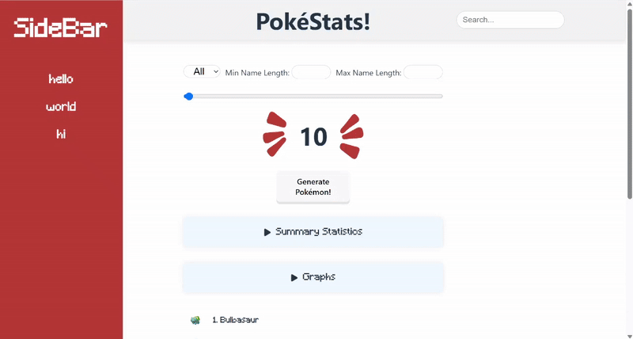

## 🎯 Goals

- [x] Fetch API data with the useEffect React hook and async/await syntax
- [x] Respond to events triggered by user interaction and handle user input
- [x] Use .map() to dynamically render a group of elements
- [x] Use .filter() to filter data based on user input
- [x] Use React Router to build navigation around the application
- [x] Use Link to dynamically generate a list of routes
- [x] Use useParams() hook to extract parameters from a URL
- [x] Install and integrate an npm library into an existing React app

## ❗ Required Features

- [x] The site has a dashboard displaying a list of data fetched using an API call
  - [x] The dashboard should display at least 10 unique items, one per row
  - [x] The dashboard includes at least two features in each row
- [x] useEffect React hook and async/await are used
- [x] The app dashboard includes at least three summary statistics about the data
  - [x] the total number of items in the dataset or which meet certain criteria in the dataset
  - [x] the mean, median, mode, or other statistic of a certain aspect of the data
  - [x] quartiles, quintiles, or ranges of the data
- [x] A search bar allows the user to search for an item in the fetched data
  - [x] The search bar correctly filters items in the list, only displaying items matching the search query
  - [x] The list of results dynamically updates as the user types into the search bar
- [x] An additional filter allows the user to restrict displayed items by specified categories
  - [x] The filter restricts items in the list using a different attribute than the search bar
  - [x] The filter correctly filters items in the list, only displaying items matching the filter attribute in the dashboard
  - [x] The dashboard list dynamically updates as the user adjusts the filter
- [x] Clicking on an item in the list view displays more details about it
  - [x] Clicking on an item in the dashboard list navigates to a detail view for that item
  - [x] Detail view includes extra information about the item not included in the dashboard view
  - [x] The same sidebar is displayed in detail view as in dashboard view
- [x] Each detail view of an item has a direct, unique URL link to that item’s detail view page
- [x] The app includes at least two unique charts developed using the fetched data that tell an interesting story
  - [x] At least two charts should be incorporated into the dashboard view of the site
  - [x] Each chart should describe a different aspect of the dataset

## 🚀 Stretch Features

- [x] Multiple filters can be applied simultaneously
- [x] Filters use different input types
  - [x] e.g., as a text input, a dropdown or radio selection, and/or a slider
- [x] The user can enter specific bounds for filter values
- [x] The site's customized dashboard contains more content that explains what is interesting about the data
  - [x] e.g., an additional description, graph annotation, suggestion for which filters to use, or an additional page that explains more about the data
- [x] The site allows users to toggle between different data visualizations
  - [x] User should be able to use some mechanism to toggle between displaying and hiding visualizations

 

GIF created with [Ezgif](https://ezgif.com/)
